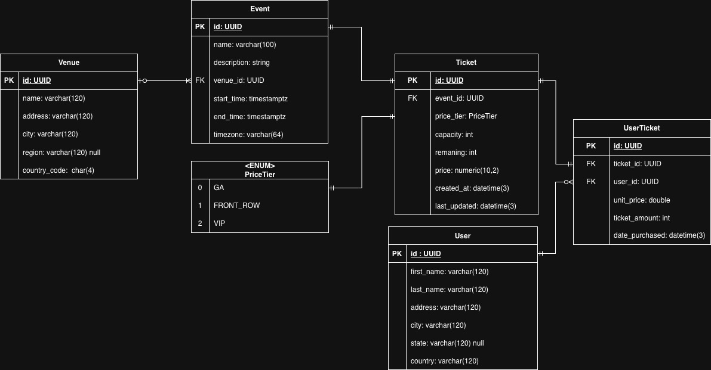

# Thoughtly Ticket Booking System

A concert ticket booking system built for the Thoughtly Application Development Engineer take-home assignment.

## Project Overview

This is an end-to-end ticket booking application with a React + TypeScript frontend and Node.js + TypeScript backend. The system prevents double-booking, supports global users, and handles high-scale traffic.

## Tech Stack

- **Backend:** Node.js 16 + TypeScript
- **Frontend:** React + TypeScript (to be implemented)
- **Database:** MySQL 8.4
- **Runtime:** Node.js 16.x

## Setup Instructions

### Prerequisites

- Node.js 16.x installed
- npm or yarn package manager
- MySQL 8.4 (for production, can use in-memory for development)

### Installation

1. Install dependencies:
```bash
npm install
```

2. Build the TypeScript project:
```bash
npm run build
```

3. Run in development mode:
```bash
npm run dev
```

4. Run in production mode (after build):
```bash
npm start
```

## Project Structure

```
thoughtly-ticket-booking/
├── src/              # TypeScript source files
├── dist/             # Compiled JavaScript (generated)
├── docs/             # Documentation and database schema
├── package.json      # Dependencies and scripts
├── tsconfig.json     # TypeScript configuration
└── README.md         # This file
```

## Assignment Requirements

### Functional Requirements

- **Ticket Catalog & Tiers:**
  - VIP: $100
  - Front Row: $50
  - General Admission (GA): $10
- **Availability:** UI to view all available tickets and quantities per tier
- **Booking:** UI & API to book tickets (1+ quantity per tier)
- **No Double-Booking:** Prevent two users from booking the same ticket simultaneously
- **Global Users:** Support users from any country (USD currency)

### Non-Functional Requirements

- **Availability:** 99.99% design intent (discussed in README)
- **Scale:** ~1,000,000 DAU; peak ~50,000 concurrent users (discussed in README)
- **Performance:** Booking request p95 < 500ms (discussed in README)

### Technical Constraints

- **Backend:** Node.js + TypeScript (or Golang)
- **Frontend:** React + TypeScript
- **Data Store:** MySQL 8.4 (transactional store)
- **Payments:** Simulated (no real payment integration)
- **Auth:** Not required

## Development Status

- ✅ **TBS-1**: Initial project setup (Node.js 16 + TypeScript)
- ✅ **TBS-2**: Adding database documentation for Ticket Booking System
- ✅ **TBS-3**: Building API contract between frontend and backend
- 🚧 Implementation in progress.

## Design Decisions & Trade-offs

### Database Schema



The database schema is defined for MySQL 8.4 and includes the following entities:

- **venue**: Stores venue information (name, address, location, timezone)
- **user**: Stores user information (name, address, location, timezone)
- **event**: Stores event information linked to venues
- **price_tier**: Defines ticket pricing tiers (GA, Front Row, VIP)
- **ticket**: Stores ticket availability and pricing per event and tier
- **user_ticket**: Stores user bookings/purchases

The complete database schema SQL can be found in [`docs/schema.sql`](docs/schema.sql).

#### Notes & Acknowledgements

- **Normalization**: The schema follows Third Normal Form (3NF) / Boyce-Codd Normal Form (BCNF) to ensure data integrity and eliminate redundancy.
- **Historical Data Preservation**: The `user_ticket.unit_price` field stores the price at the time of purchase, preserving historical pricing even if ticket prices change.
- **Event-Specific Pricing**: The `ticket.price` field allows for event-specific pricing that may differ from the `price_tier.default_price`, enabling flexible pricing strategies.
- **Concurrency Control**: Using atomic updates on the `ticket` table prevents two users from accessing the same ticket type simultaneously. The following SQL query locks the ticket row such that two users cannot update the same ticket type:

```sql
BEGIN TRANSACTION;

update ticket
   set remaining = remaining - :qty
where id = :ticketId AND remaining >= :qty;

-- Check affectedRows before committing
-- If affectedRows = 0, rollback the transaction
-- ...
COMMIT;
```

This approach ensures that:
  - The transaction provides isolation, ensuring the update is atomic and consistent
  - The row-level lock prevents concurrent updates to the same ticket row
  - If the number of remaining tickets reaches zero, `affectedRows = 0` on one of the concurrent requests prevents any change to the ticket count
  - The `remaining >= :qty` condition ensures we never go below zero
  - Wrapping in a transaction ensures that if the booking fails (e.g., payment simulation fails), the ticket count can be rolled back

## License

ISC

